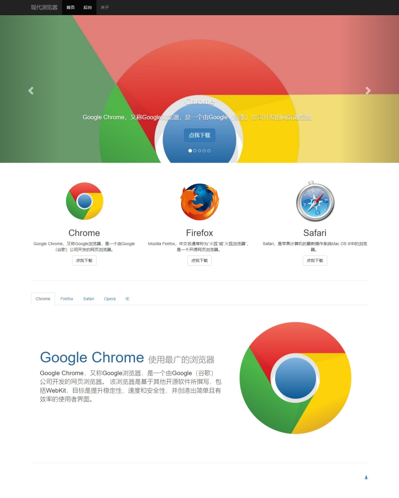
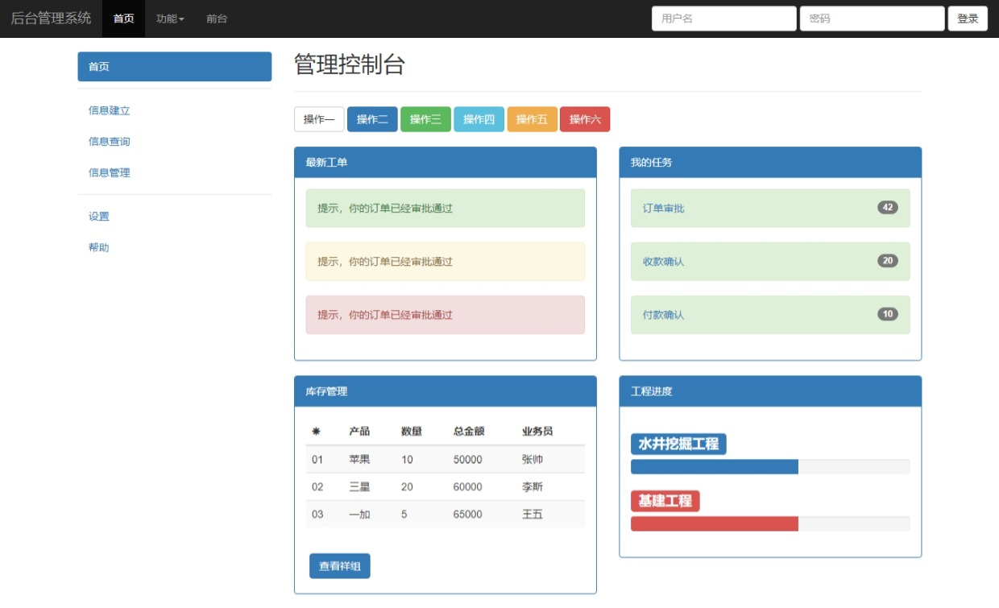

# 现代浏览器
- 结构：响应式Bootstrap框架布局

- 截图:ice_cream:

  - 前台

  

  - 后台

  

- 演示地址:ocean:：https://vogadero.github.io/ModernBrowser/

# Tree🌵    
```
现代浏览器-响应式Bootstrap框架布局
├─ .history
│  ├─ README_20220504142816.md
│  └─ README_20220504142823.md
├─ 01.jpeg
├─ 02.jpeg
├─ admin.html
├─ css
│  ├─ main.css
│  └─ normalize.css
├─ favicon.ico
├─ images
│  ├─ chrome-big.jpg
│  ├─ chrome-logo-small.jpg
│  ├─ chrome-logo.jpg
│  ├─ firefox-big.jpg
│  ├─ firefox-logo-small.jpg
│  ├─ firefox-logo.jpg
│  ├─ ie-big.jpg
│  ├─ ie-logo.jpg
│  ├─ logo.psd
│  ├─ opera-big.jpg
│  ├─ opera-logo.jpg
│  ├─ QQ20160801-1.png
│  ├─ safari-big.jpg
│  ├─ safari-logo-small.jpg
│  └─ safari-logo.jpg
├─ index.html
├─ js
│  └─ jquery-3.6.0.min.js
├─ README.md
└─ vendor
   └─ bootstrap-3.4.1-dist
      ├─ css
      │  ├─ bootstrap-theme.css
      │  ├─ bootstrap-theme.css.map
      │  ├─ bootstrap-theme.min.css
      │  ├─ bootstrap-theme.min.css.map
      │  ├─ bootstrap.css
      │  ├─ bootstrap.css.map
      │  ├─ bootstrap.min.css
      │  └─ bootstrap.min.css.map
      ├─ fonts
      │  ├─ glyphicons-halflings-regular.eot
      │  ├─ glyphicons-halflings-regular.svg
      │  ├─ glyphicons-halflings-regular.ttf
      │  ├─ glyphicons-halflings-regular.woff
      │  └─ glyphicons-halflings-regular.woff2
      └─ js
         ├─ bootstrap.js
         ├─ bootstrap.min.js
         └─ npm.js
```